# 🛍 Shopaholic E-Commerce Platform

Welcome to **Shopaholic**, a modern, sleek and minimalistic e-commerce platform designed for effortless shopping and elegant aesthetics.

## 🌟 Features
- 🔍 **Smart Search** – Instantly find products with a dynamic search bar using **signals** for real-time updates.
- 🛒 **Cart & Wishlist** – Seamlessly add products using optimized **services** for efficient state management.
- 🎭 **Animated UI** – Smooth animations for an engaging experience.
- 🏷 **Category Swiper** – Explore product categories with a stylish responsive carousel powered by Swiper.js.
- 🔔 **Toast Notifications** – Get instant feedback with auto-dismiss toasts for cart, wishlist, and admin actions.
- 🔐 **Admin Panel** – Manage products, orders, and users efficiently with **route guards** for access control.
- 🌎 **Fully Responsive Design** – Optimized layout using **Tailwind CSS** to ensure an effortless experience across all devices.

## 🚀 Tech Stack
- **Frontend**: Angular, TypeScript, Tailwind CSS  
- **Backend**: JSON Server and JSON Server Auth (Mock API)  
- **UI Components**: DaisyUI, Angular Material, Swiper.js  
- **State Management**: Angular signals for real-time updates and improved rendering performance
- **Routing**: Angular Router with route guards for user authentication and admin access

## 🔧 Installation
Clone the repository and install dependencies:

```sh
git clone https://github.com/ollaanoor/Shopaholic-Angular-Ecommerce.git
cd shopaholic
npm install
```

## Development server

To start a local development server, run:

```bash
ng serve
```

Once the server is running, open your browser and navigate to `http://localhost:4200/`. 

## Run the json server

```bash
npx json-server-auth db.json
```

## Folder structure
```
/src
 ├── /app
 │   ├── /components       # UI Components
 │   ├── /services         # API & Data Services
 │   ├── /pages            # Main Pages (Home, About, Admin)
 │   ├── /assets           # Images & Icons
 │   ├── /styles           # Global Styles
 ├── db.json               # Mock Database
 ├── angular.json          # Angular Config
 ├── package.json          # Dependencies
```

## 🖥️ Desktop View
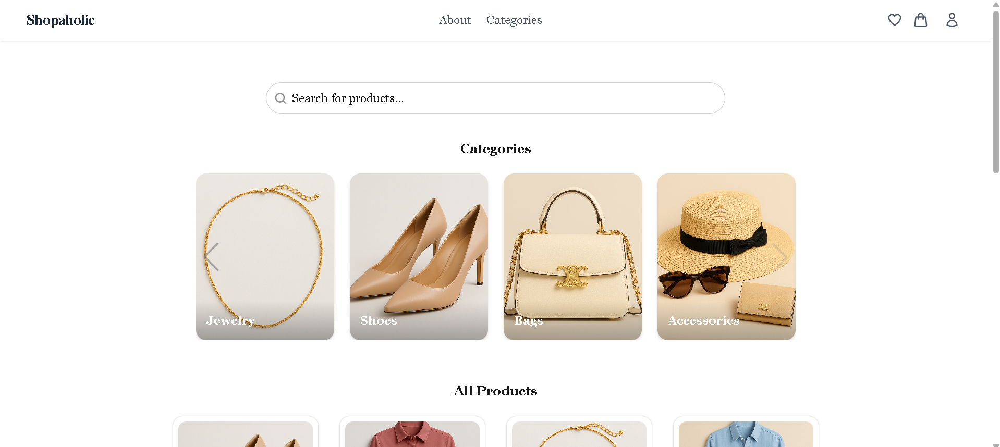

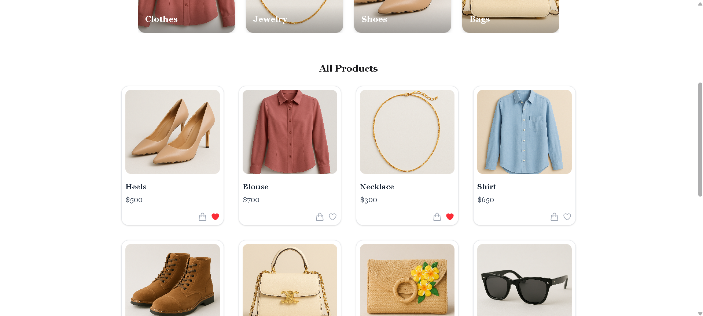

## 📱 Mobile View
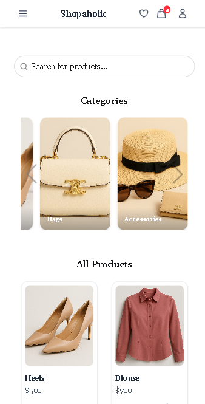

## Register
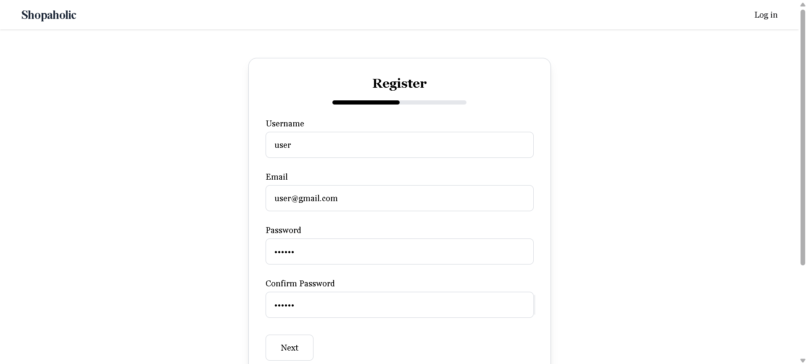

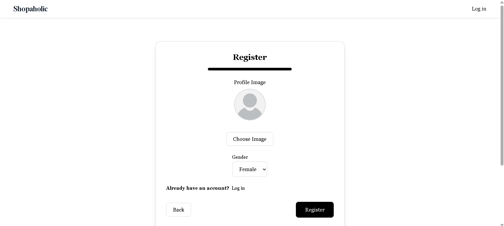

## Login
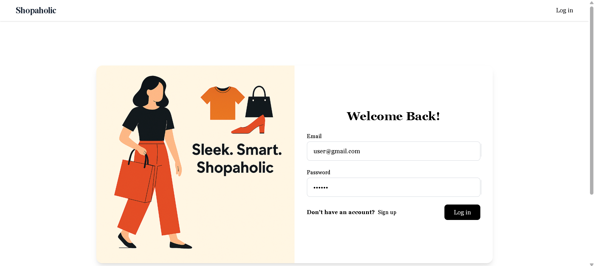

## Category
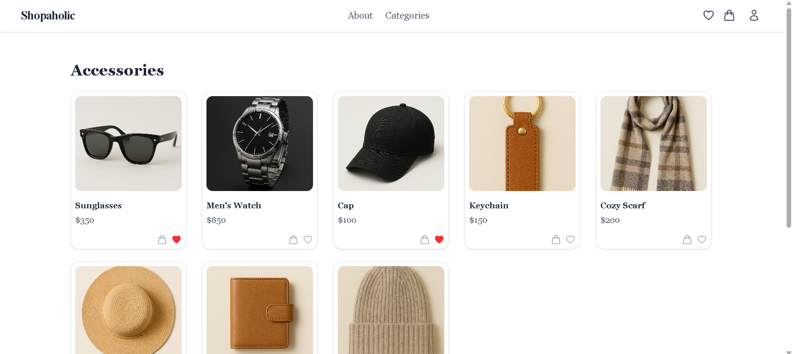

## Wishlist
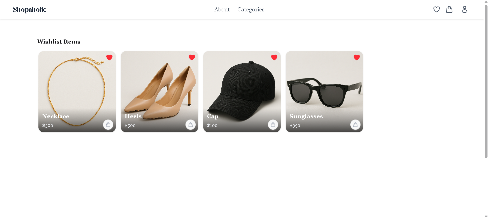

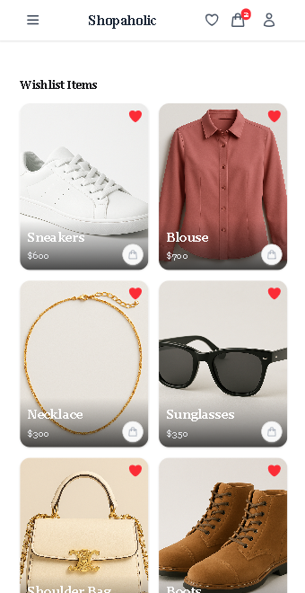

## Product Page & Cart (desktop view)
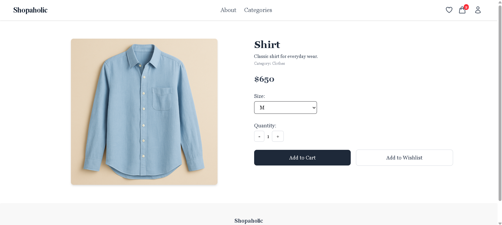

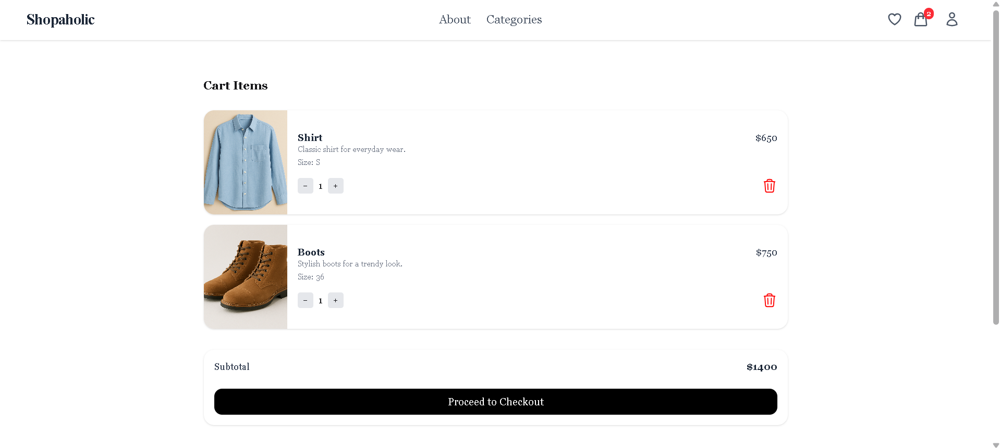

## Product Page & Cart (mobile view)
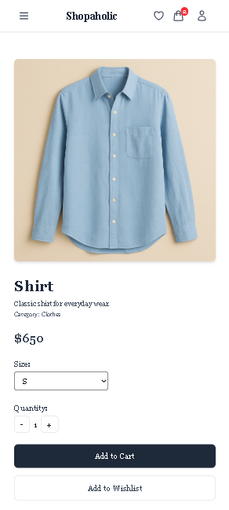

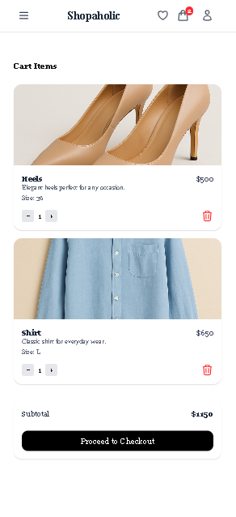

## User Profile
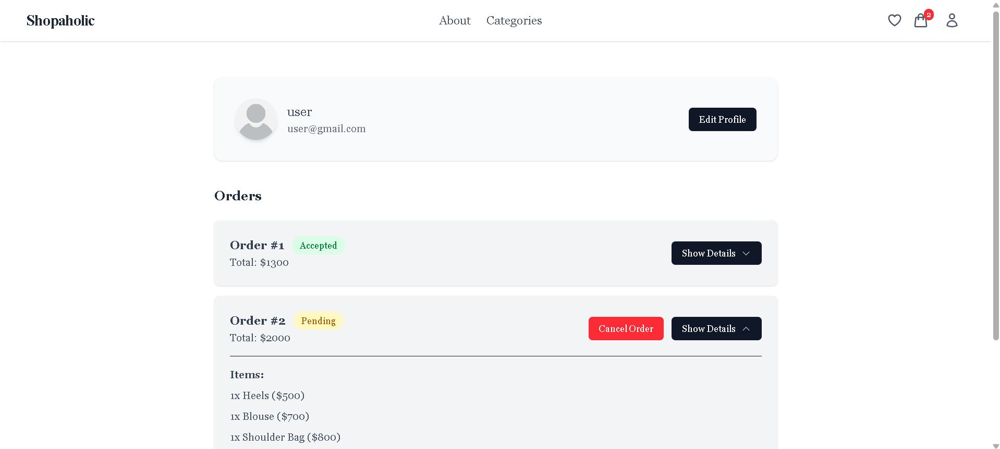

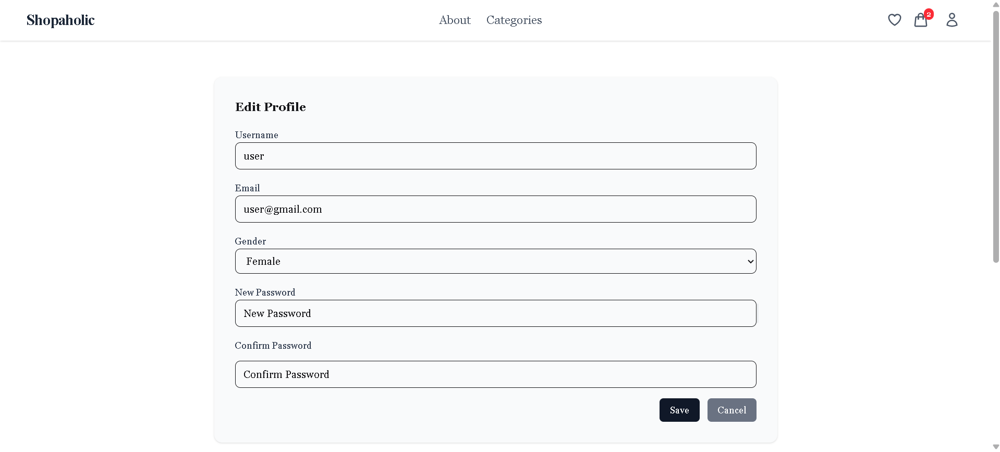

## Admin
# Product Manager
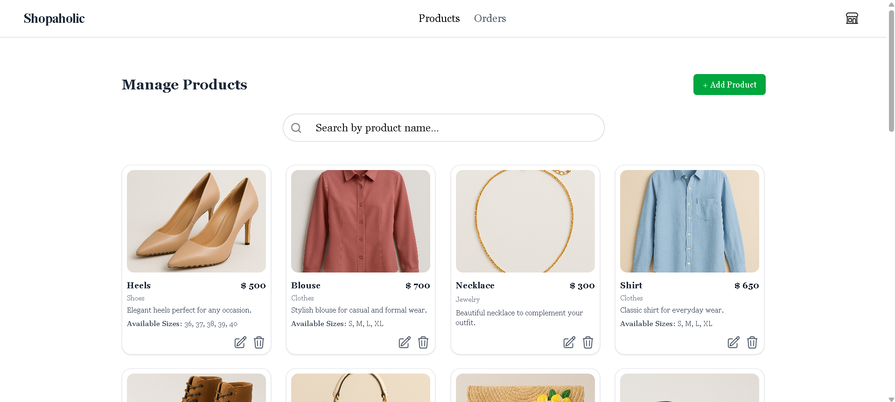

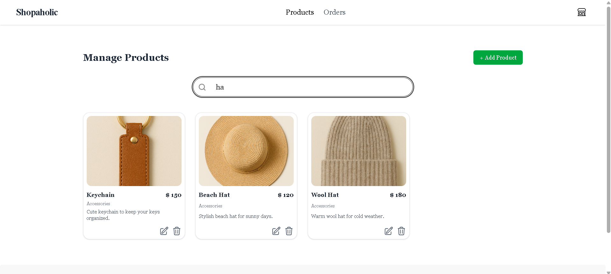

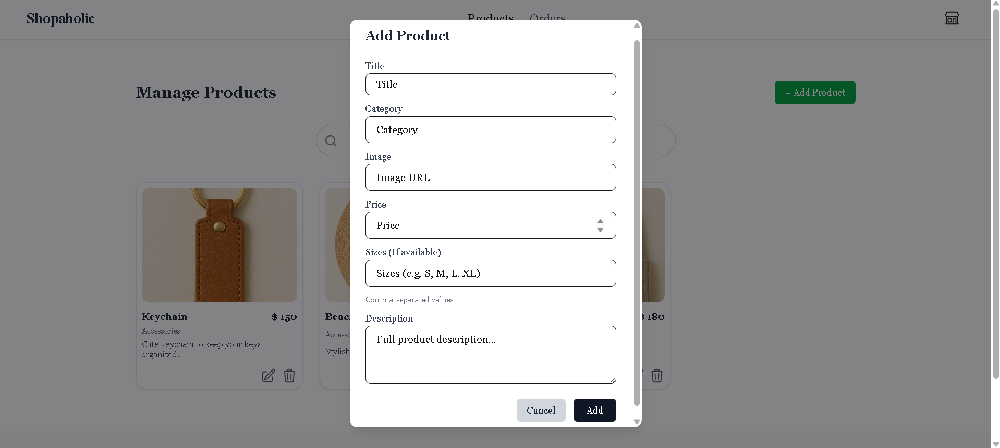

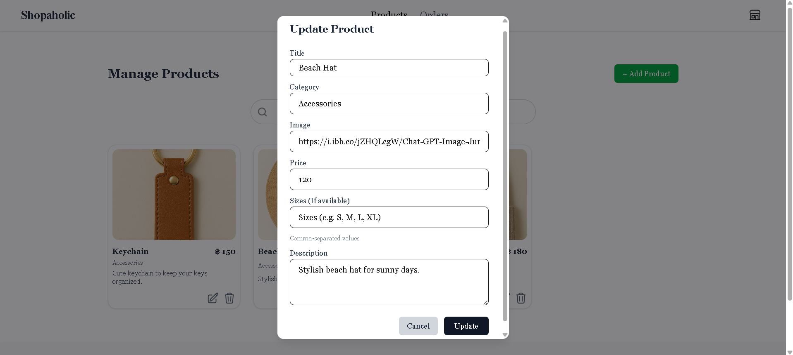

# Order Manager
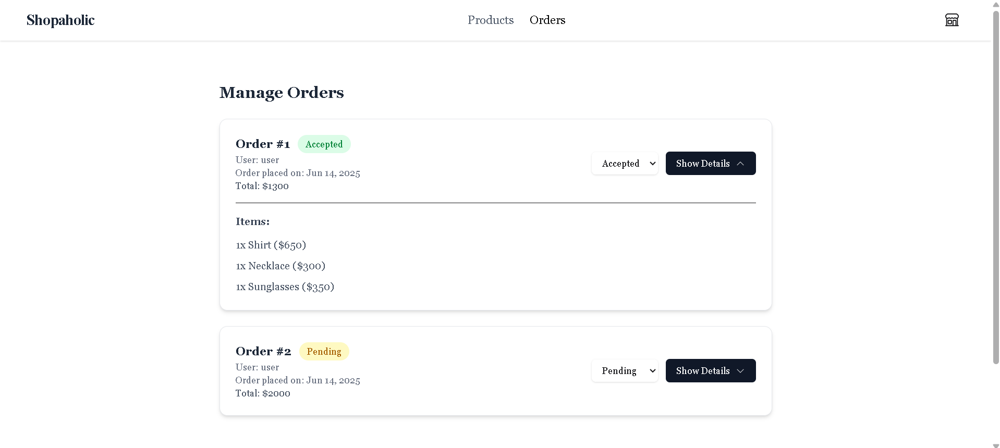

## 🎥 Demo Video
[Watch the Demo](https://drive.google.com/file/d/1K3ph5oBJpHlH2unBS_CnNydgPH_jnlnj/view?usp=drive_link)